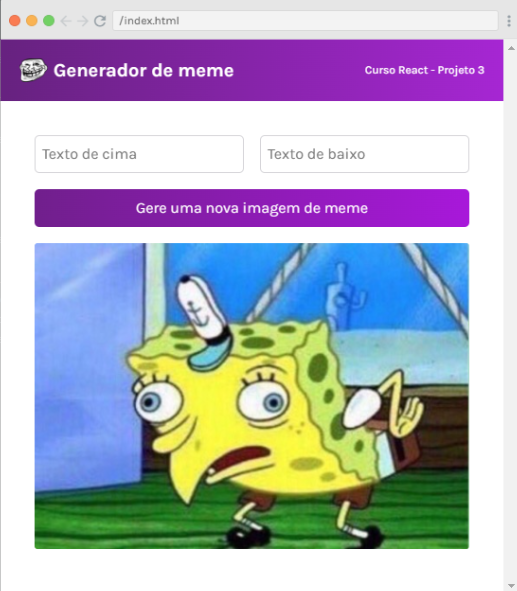

<h1> 

Estudos React

</h1>

<h3> 

Repositório criado para armazenar todos os os meus projetos React enquanto eu estudo e avanço. O link no título do projeto leva ao deploy do Netlify.

<h3>

   

<h1> Índice </h1>
<ol>
   <li><a href="#projetos">Projetos</a></li>
   <li><a href="#prints">Prints</a></li>
   <li><a href="#cursos">Cursos</a></li>
</ol>

<h1 id="projetos"> Projetos: </h1>

<h3>

1. [Fatos Divertidos Sobre o React](https://subtle-cupcake-3362aa.netlify.app/)   

</h3>   
 
<ul>
   <li><a href="#curiosidade">Print do projeto</a></li>
   <li>Conceitos aprendidos: </li>
      <ul>
         <li> Componentização </li>
         <li> Revisão Vanilla JS </li>
         <li> Estilização </li>
      </ul>
</ul>
  

  
   
<h3>
   
2. [Clone Airbnb](https://merry-truffle-cbe0f7.netlify.app/)

</h3>

<ul>
   <li><a href="#airbnb">Print do projeto</a></li>
   <li>Conceitos aprendidos: </li>
   <ul>      
      <li> Componentização </li>  
      <li> Utilização de props </li>  
      <li> Uso do Map em componentes </li>
      <li> Uso de dados em um objeto de arrays </li>
      <li> Estilização </li>
   </ul>      
</ul>

<h3>

3. Diário de Viagem

</h3>

<ul>
   <li> Baseado no Solo Project sugerido pelo Scrimba para consolidar os conteúdos aprendidos anteriormente</li>
   <li><a href="#diario">Print do projeto</a></li>
   <li>Conceitos utilizados: </li>
   <ul>    
      <li> Componentização </li>  
      <li> Utilização de props </li>  
      <li> Uso do Map em componentes </li>
      <li> Uso de dados em um objeto de arrays </li>
      <li> Estilização </li>
   </ul>
   <li> Dificuldade:   Buildar e dar deploy no projeto por conta das dependências do Babel utilizado no curso do Scrimba (não consegui) e por conta de um erro que não consegui resolver no spread operator </li>
</ul>

<h3>

4. Gerador de memes

</h3>

<ul>
   <li><a href="#memes">Print do projeto</a></li>
   <li>Conceitos utilizados: </li>
   <ul>    
      <li> utilização do useState e setState </li>  
      <li> Utilização do useEffects para utilizar a API </li>  
      <li> Consumo de API pelo método fetch </li>
      <li> Uso de formulários em React </li>
      <li> Exibição de componentes condicionalp </li>
   </ul>      
   <li> Dificuldade:   Buildar e dar deploy no projeto por conta das dependências do Babel utilizado no curso do Scrimba (não consegui) e por conta de um erro que não consegui resolver no spread operator </li>
</ul>

<h1 id="prints"> Prints </h1> 

<h1 id="cursos"> Cursos </h1> 
<ul>
   <li><a href="https://scrimba.com/learn/learnreact">Scrimba</a></li>
   <li><a href="https://st.devsamurai.com.br/8zs2xdqd/index.html?utm_source=&utm_medium=cpc&utm_campaign=18060134806&utm_content=616654968648&xpromo=gl-616654968648&utm_term=140407640619&gclid=Cj0KCQiA6rCgBhDVARIsAK1kGPJLFR3HKhc80GUY7iEGolQbN5O40yNJsFxuaWtdhD-hmfviK3whpo8aAt6aEALw_wcB">Dev Samurai</a></li>
</ul>
